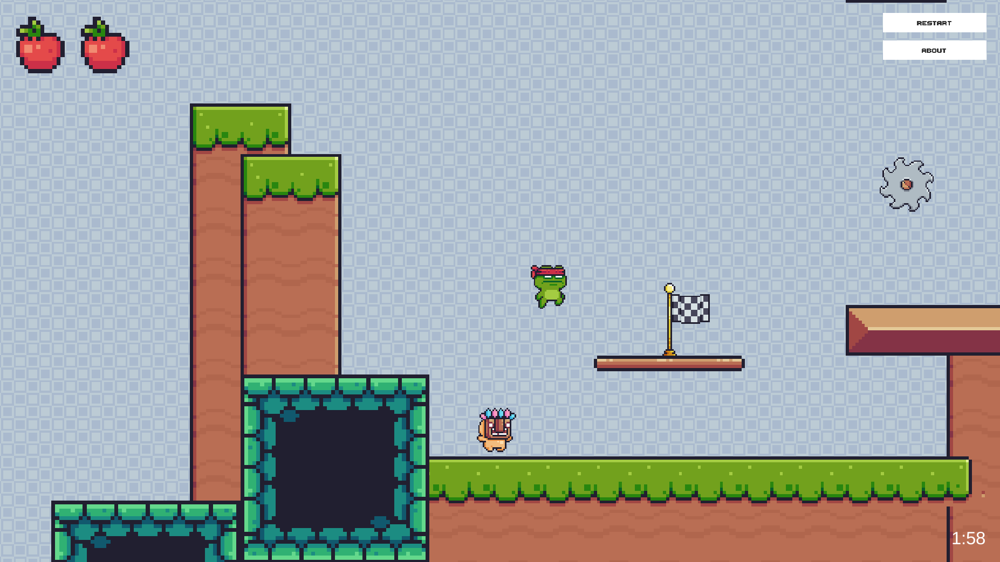

# My First Unity Game: Ninja Frog Platformer

**A platformer with some dexterity-based problem solving elements**

## Play the game

Go here to play: https://jakeaufderheide.github.io/ninja_frog_platformer/

 

## Controls
Movement = Left Stick / A / D / L-Arrow / R-Arrow

Dash = F / R-Trigger

Attack = S / West Button (X)

Jump = Space / Up-Arrow / South Button (A)

## Attributions
Level Music: https://opengameart.org/users/of-far-different-nature

Boss Music: https://opengameart.org/users/horrorpen

Graphics: https://pixel-frog.itch.io/pixel-adventure-1

Unity: https://store.unity.com/#plans-individual

